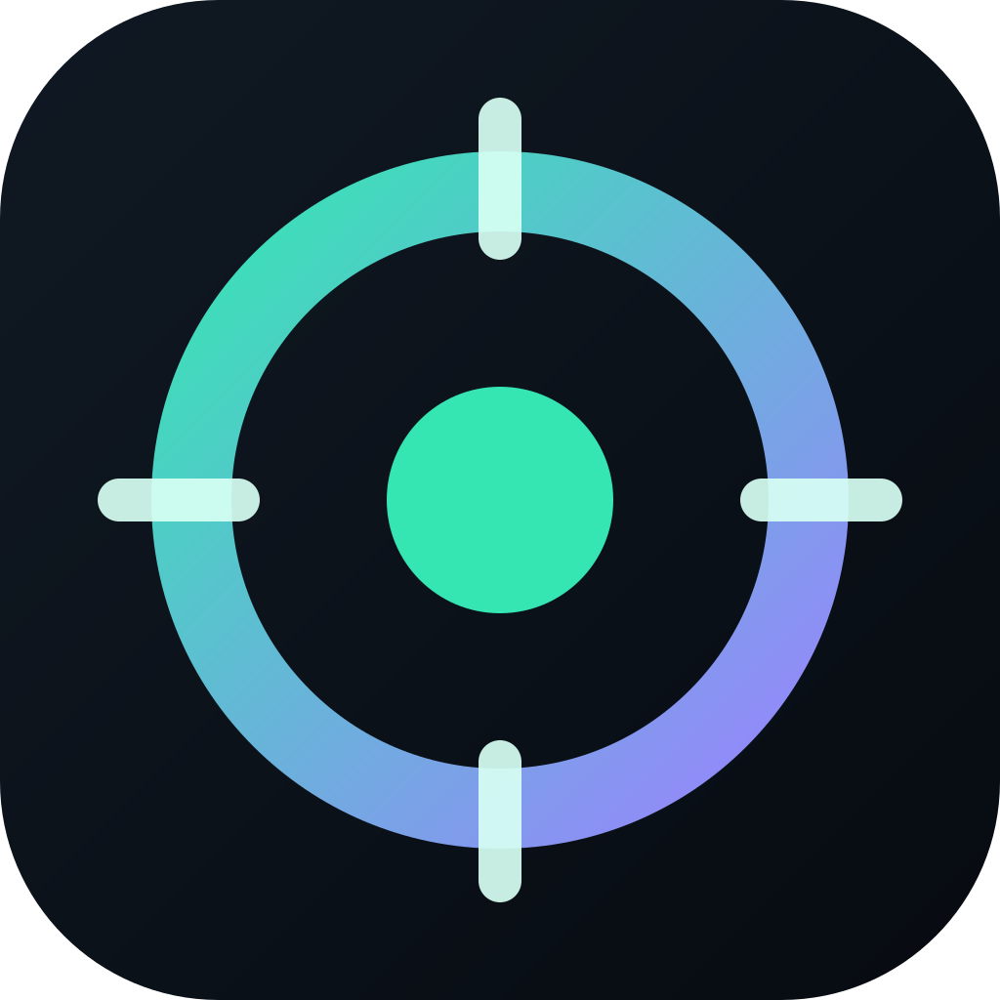
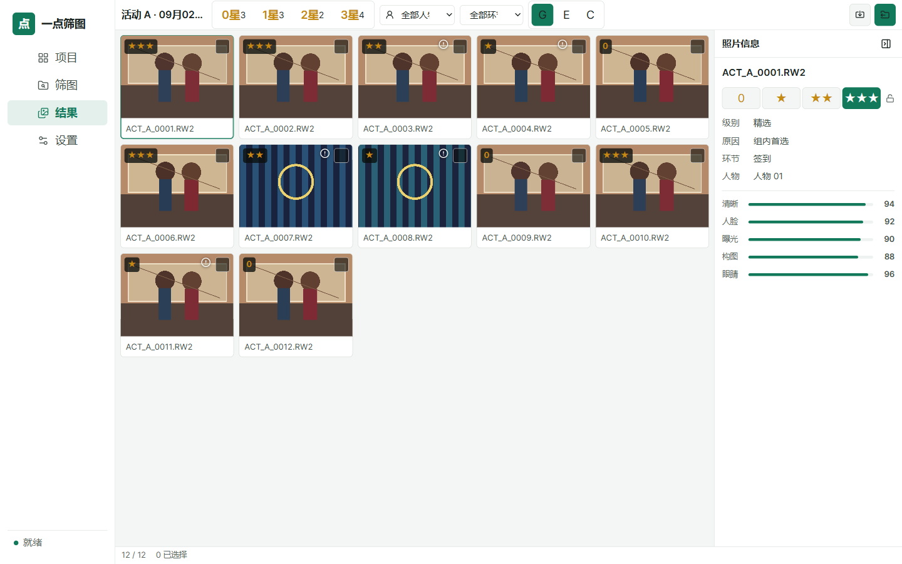
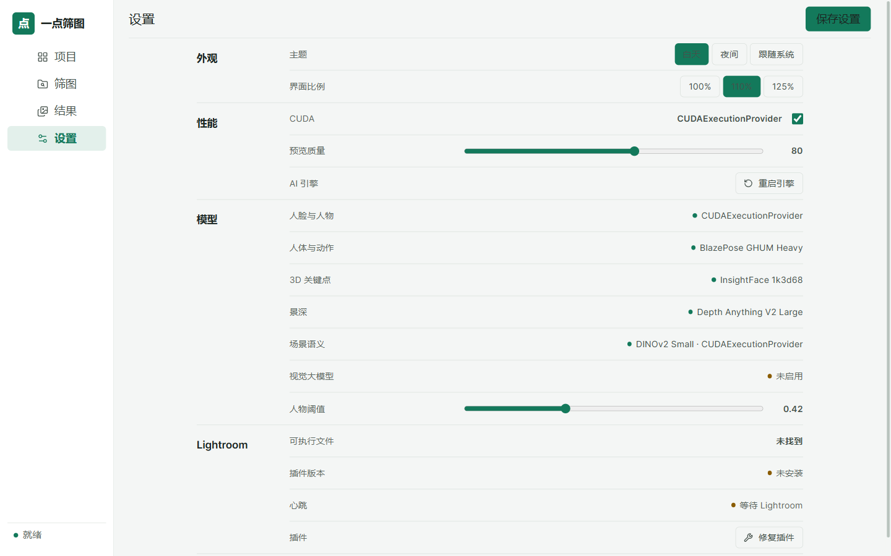
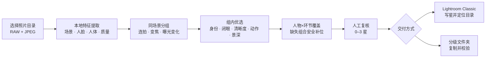

<div align="center">



<h1>一点筛图</h1>

<p><strong>本地 AI 驱动的活动照片筛选与 Lightroom 交付工作台</strong></p>

<p>同场景去重 · 同人物优选 · 人物×环节补位 · 0–3 星评级 · 全程离线</p>

<p>
  <a href="https://github.com/weimanmk/yidian-photo-cull/releases/tag/v0.2.1"></a>
  
  
  <a href="LICENSE"></a>
</p>

<p>
  <a href="https://github.com/weimanmk/yidian-photo-cull/releases/tag/v0.2.1"><strong>下载 v0.2.1</strong></a>
  ·
  <a href="#how-it-works">工作原理</a>
  ·
  <a href="#lightroom-classic">Lightroom</a>
  ·
  <a href="docs/ALGORITHM.md">算法文档</a>
</p>

<br />



</div>

---

## ⚡ 30 秒了解

一点筛图面向活动、会议、赛事和纪实摄影：读取本地 RAW / JPEG，先把同场景和连续动作照片归组，再综合人物身份、闭眼、清晰度、表情、姿态、景深与构图选出更值得交付的画面。

| | | |
| --- | --- | --- |
| **🧩 同场景归组**<br />融合视觉向量、拍摄时间与图像指纹，合并连拍、变焦和曝光变化。 | **👤 同人物优选**<br />联合人脸与人体证据，减少不同人物误合并和远景漏检。 | **⭐ 语义化星级**<br />3 星精选、2 星覆盖补位、1 星其他价值、0 星废片。 |
| **🛡️ 覆盖保底**<br />检查人物×环节组合，避免某个人在某个环节被全部过滤。 | **📷 Lightroom 接力**<br />预检后写入星级，保护已有 4/5 星，并自动定位本次照片目录。 | **🔒 完全离线**<br />照片、人脸向量、项目记录和模型推理都留在本机。 |

## ✨ 核心能力

- **减少重复**：DINOv2、图像指纹、色彩、边缘、拍摄时间和相邻组二次合并共同抑制近重复。
- **人物一致性**：SCRFD + ArcFace 判断可靠人脸身份；远景和背身场景由人体检测与 OSNet 外观向量补充。
- **人脸细节复核**：106 点二维关键点、3D68 姿态、睁闭眼、表情、eDifFIQA 与原分辨率眼区清晰度共同参与排序。
- **动作与景深理解**：3D 人体骨架区分动作阶段；Depth Anything V2 辅助判断主体合焦与背景分离。
- **多人照片防短板**：重点惩罚最差人脸，避免“一人清晰、其他人闭眼或失焦”的照片进入精选。
- **人物×环节覆盖**：启用保底后，在最终排序阶段补回风险最低的缺失组合，并标记为需复核。
- **人工复核工作台**：网格、单张、对比三种视图，支持星级、人物、环节过滤与键盘快速定星。
- **安全交付**：可写入 Lightroom Classic，也可按星级复制到分级文件夹；不移动、不覆盖源照片。
- **GPU 加速**：NVIDIA 环境优先 ONNX Runtime CUDA 12 + cuDNN 9；其他设备可用 DirectML，最终回退 CPU。
- **可续跑与个性化**：SQLite 复用特征和预览；人工“已修”结果可训练带交叉验证门禁的轻量排序模型。

算法细节见 [算法与决策链](docs/ALGORITHM.md)，匿名真实数据集回归结果见 [回归报告](docs/REAL_SET_REPORT.md)。

## 🖼️ 界面预览

<table>
<tr>
<td width="58%">

<strong>结果复核</strong>


</td>
<td width="42%">

<strong>本地设置</strong>



</td>
</tr>
</table>

> 截图使用隔离的合成演示素材与“活动 A”占位项目，不包含真实活动名称、人物照片或本机私人路径。

## 🚀 下载与安装

当前稳定版本：**v0.2.1**

[前往 GitHub Release 下载](https://github.com/weimanmk/yidian-photo-cull/releases/tag/v0.2.1)

Release 包含：

```text
Yidian-Photo-Cull-0.2.1-Windows-Setup.exe
Yidian-Photo-Cull-0.2.1-Windows-CUDA.7z.001
Yidian-Photo-Cull-0.2.1-Windows-CUDA.7z.002
Yidian-Photo-Cull-0.2.1-Windows-CUDA.7z.003
SHA256SUMS-CUDA.txt
```

1. 下载上述五个文件并放入同一目录。
2. 将三个分卷重命名为安装器识别的中文名称：

   ```text
   一点筛图-0.2.1-Windows-CUDA.7z.001
   一点筛图-0.2.1-Windows-CUDA.7z.002
   一点筛图-0.2.1-Windows-CUDA.7z.003
   ```

3. 双击 `Yidian-Photo-Cull-0.2.1-Windows-Setup.exe` 并选择安装目录。

完整 CUDA 版包含 CUDA 12、cuDNN 9、Python 引擎、Lightroom 插件和视觉模型，不包含 Qwen3.8-27B、GGUF、mmproj、llama.cpp、训练集或测试照片。安装过程不联网；电脑仍需安装兼容的 NVIDIA 驱动。项目当前为私有仓库，下载需要具备访问权限的 GitHub 账号。

本版本没有商业代码签名证书，Windows 可能显示“未知发布者”。可使用 `SHA256SUMS-CUDA.txt` 核对安装器与分卷的 SHA-256。

## ⭐ 星级规则

| 星级 | 含义 | 默认用途 |
| --- | --- | --- |
| ★★★ | 精选 | 主交付照片 |
| ★★ | 人物×环节补位 | 保证人物与活动环节覆盖 |
| ★ | 其他有价值 | 备选、记录性画面 |
| 0 | 废片 | 不进入文件夹导出 |

人工修改星级后，筛选统计、Lightroom 写入和文件夹导出都会使用最新结果。Lightroom 中已有的 4 星和 5 星照片受保护，不会被降级。

<a id="how-it-works"></a>

## 🏗️ How It Works



1. 扫描目录并配对同名 RAW + JPEG，JPEG 优先用于快速预览，RAW 始终作为交付文件。
2. 在本机提取场景、人脸、人体、姿态、景深与画质证据。
3. 将同一场景和连续动作归组，并二次合并跨组近重复。
4. 每组按综合质量排序，再执行人物×环节覆盖检查。
5. 用户在工作台复核和调整 0–3 星。
6. 结果写入 Lightroom 或复制到分级文件夹，全程不修改源照片。

## 🧠 模型栈

| 任务 | 模型 / 方法 | 作用 |
| --- | --- | --- |
| 场景理解 | DINOv2 Small / MobileNetV2 | 场景向量与相邻组判断 |
| 人脸检测 | InsightFace SCRFD `det_10g` | 多尺度人脸定位 |
| 人物身份 | InsightFace ArcFace `w600k_r50` | 512 维身份向量 |
| 人脸关键点 | InsightFace `2d106` / `1k3d68` | 眼部几何、头部姿态与构图 |
| 眼睛状态 | OpenVINO `open-closed-eye-0001` | 睁闭眼判断 |
| 表情 | MobileFaceNet FER | 表情辅助排序 |
| 人脸质量 | eDifFIQA Tiny | 感知质量证据 |
| 人体检测 | YOLOv8n / MediaPipe | 远景、侧身和背身人物补充 |
| 人物外观 | OSNet x0.25 MSMT17 | 无可靠人脸时的外观相似度 |
| 3D 姿态 | MediaPipe BlazePose GHUM Heavy | 动作阶段与姿态质量 |
| 相对景深 | Depth Anything V2 Large | 主体合焦与背景分离辅助 |

模型不可用时会按任务降级，不会把缺失模型伪装成已启用。完整来源、SHA-256 与许可见 [THIRD_PARTY_MODELS.md](THIRD_PARTY_MODELS.md)。

<a id="lightroom-classic"></a>

## 📷 Lightroom Classic

要求 Windows 版 Lightroom Classic 14.3 或更高版本。插件标识为 `com.yidian.photocull.lightroom`，随 v0.2.1 安装包分发。

1. 打开要写入照片的 Lightroom 目录。
2. 在一点筛图结果页点击“导入 Lightroom”。
3. 首次使用时安装插件；若 Lightroom 已打开，在增效工具管理器中点击“重新载入增效工具”。
4. 等待插件心跳正常并执行只读预检。
5. 核对新增、更新、不变、保护和无效数量，再确认导入。
6. 插件加入缺失照片、写入 0–3 星、回读验证，并切换到本次照片所在文件夹。

桥接仅使用 `%APPDATA%/Adobe/Lightroom/YidianPhotoCull/lightroom-bridge` 下的本地原子文件，不访问网络。

## 🔐 隐私与安全

- 后端只监听 `127.0.0.1`，Electron 使用随机本地令牌访问 API。
- 照片、人脸向量、项目记录、缓存和训练反馈默认保存在本机。
- 不需要登录，不包含会员、积分、额度、远程报告或遥测。
- 不删除、移动、重命名或覆盖源照片。
- 文件夹导出先预检冲突，再复制并执行 SHA-256 回读校验。
- Lightroom 导入先预检、后确认、再回读；已有 4/5 星受保护。

本地数据默认位于 `%LOCALAPPDATA%/YidianPhotoCull`。

## 🧰 技术栈

<div align="center">


<br /><br />


</div>

| 层级 | 技术 |
| --- | --- |
| 桌面端 | Electron |
| 界面 | React、TypeScript、Vite、shadcn/ui、Radix UI、Tailwind CSS |
| 本地引擎 | Python 3.12、FastAPI |
| 推理 | ONNX Runtime CUDA / DirectML / CPU、LiteRT |
| 图像 | OpenCV、Pillow、rawpy、pillow-heif |
| 数据 | SQLite、JSON 项目文件、JPEG 预览缓存 |
| Lightroom | Lua 插件与本地原子文件桥接 |

## 🛠️ 源码运行

需要 Node.js 20+、Python 3.12 和 `uv`。

NVIDIA CUDA 环境：

```powershell
Set-Location "C:/path/to/photocull-studio"
uv venv ".venv-cuda312" --python 3.12
uv pip install --python ".venv-cuda312/Scripts/python.exe" -e "backend[cuda,dev]"
npm ci
powershell -ExecutionPolicy Bypass -File "scripts/setup-models.ps1"
powershell -ExecutionPolicy Bypass -File "scripts/setup-face-models.ps1" -AcceptNonCommercialLicense
npm run dev
```

AMD / Intel 显卡或 CPU 环境：

```powershell
uv venv ".venv" --python 3.12
uv pip install --python ".venv/Scripts/python.exe" -e "backend[directml,dev]"
npm ci
powershell -ExecutionPolicy Bypass -File "scripts/setup-models.ps1"
powershell -ExecutionPolicy Bypass -File "scripts/setup-face-models.ps1" -AcceptNonCommercialLicense
npm run dev
```

CUDA 和 DirectML 依赖都安装在项目虚拟环境中，不修改系统级 CUDA 或全局 Python。只有完成首次推理后显示 `CUDAExecutionProvider`，才代表 NVIDIA 加速实际生效。

## ✅ 验证

```powershell
npm run typecheck
npm test
npm run build
npm run verify:ui
& ".venv-cuda312/Scripts/python.exe" -m pytest "backend/tests" -q
```

DirectML 环境将最后一条命令中的 `.venv-cuda312` 改为 `.venv`。

## 📦 Windows 打包

标准安装包：

```powershell
npm ci
uv pip install --python ".venv/Scripts/python.exe" "pyinstaller==6.22.2"
powershell -ExecutionPolicy Bypass -File "scripts/setup-models.ps1"
powershell -ExecutionPolicy Bypass -File "scripts/setup-face-models.ps1" -AcceptNonCommercialLicense
npm run package:win
npm run verify:package
```

NVIDIA CUDA 分卷安装包：

```powershell
uv pip install --python ".venv-cuda312/Scripts/python.exe" "pyinstaller==6.22.2"
npm run package:win:cuda
npm run verify:package:cuda
```

CUDA 成品必须在具备 NVIDIA GPU 的 Windows 主机上完成真实推理门禁，避免把 CPU 回退误判为 CUDA 可用。

## 🧪 评估与个性化训练

生成联系表与重复泄漏报告：

```powershell
& ".venv-cuda312/Scripts/python.exe" "scripts/make-contact-sheet.py"
$env:PYTHONPATH = "backend"
& ".venv-cuda312/Scripts/python.exe" "scripts/audit-duplicate-leakage.py" --full-preview
```

使用人工参考目录评估：

```powershell
& ".venv-cuda312/Scripts/python.exe" "scripts/evaluate-human-reference.py" `
  --reference-dir "C:/path/to/已修" `
  --output-dir "output/evaluation"
```

训练摄影师偏好模型：

```powershell
& ".venv-cuda312/Scripts/python.exe" "scripts/train-preference.py" `
  --source-dir "C:/path/to/原片" `
  --reference-dir "C:/path/to/已修" `
  --report "output/preference-training.json"
```

训练按整组隔离交叉验证；只有组内排序、全局 AUC 与 F1 达到门槛时，个性化模型才会获得正式排序权重。

## 📚 文档

- [算法与决策链](docs/ALGORITHM.md)
- [匿名真实数据集回归报告](docs/REAL_SET_REPORT.md)
- [本地视觉大模型接口](docs/VLM.md)
- [第三方模型来源与许可](THIRD_PARTY_MODELS.md)
- [版本说明](RELEASE_NOTES.md)

## 🤝 贡献

欢迎提交 Issue 和 Pull Request。提交代码即表示你有权按本项目许可证提供该贡献；涉及新模型时，请同时补充来源、版本、SHA-256、运行用途与许可边界。

## ⚖️ 许可

本项目原创代码 Copyright © 2026 weimanmk，采用 [GNU Affero General Public License v3.0 only](LICENSE)（SPDX：`AGPL-3.0-only`）。

第三方库、模型与权重不因本项目许可证而改变原有授权。尤其需要注意：

- Ultralytics YOLOv8 适用 AGPL-3.0 或另行取得企业授权。
- Depth Anything V2 Large 权重适用 CC-BY-NC-4.0。
- InsightFace `buffalo_l` 公开预训练模型仅限非商业学术研究，商业使用需另行授权。

因此，使用内置上述权重的标准发行包时，必须同时遵守相应第三方许可；计划商业使用前应替换受限模型或取得授权。完整清单见 [THIRD_PARTY_MODELS.md](THIRD_PARTY_MODELS.md)。

> 本说明不构成法律意见；使用者需自行确认其分发与使用场景满足所有适用许可。
